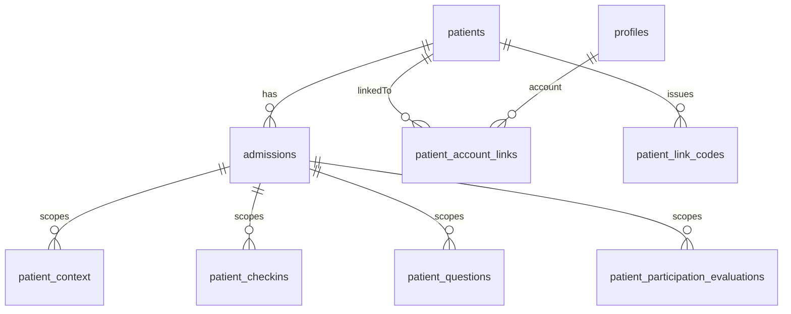

# Deferred notes

Items we know about but are intentionally not fixing yet for the MVP.
Revisit when the feature that triggers them is built.

---

## Supabase: sequence grants for SERIAL/BIGSERIAL tables

**Status:** Parked — not applicable yet  
**Added:** 2026-06-29  
**Trigger:** A new table uses `SERIAL`, `BIGSERIAL`, or `GENERATED ... AS IDENTITY`, and authenticated users `INSERT` via the Supabase client.

**Context:** `supabase/migrations/00002_api_grants.sql` sets default privileges for tables only, not sequences. The current auth schema (`profiles`, `roles`, `user_roles`) uses UUID primary keys only.

**Symptom:** `permission denied for sequence ...` on `INSERT`.

**Fix when needed:**

```sql
grant usage, select on all sequences in schema public to authenticated;

alter default privileges in schema public
  grant usage, select on sequences to authenticated;
```

**Reference:** [Supabase — Understanding API keys](https://supabase.com/docs/guides/getting-started/api-keys)

---

## Patient participation: morning / evening scheduling

**Status:** Parked — data layer exists, scheduling logic does not  
**Added:** 2026-06-30  
**Trigger:** Evening evaluation UI, home-dashboard phase reminders, or DagBuddy daily rhythm.

**Context:** Morning check-in and evening participation evaluation use calendar dates (`check_in_date`, `evaluation_date`) in Europe/Amsterdam. The app does not yet use time-of-day windows or evening reminders.

**Full plan:** [`docs/future-participation-scheduling.md`](docs/future-participation-scheduling.md)

---

## Patient questions: daily summary (QuestionBuddy)

**Status:** Parked — branch 2 is editor only  
**Added:** 2026-06-30  
**Trigger:** Branch 8 QuestionBuddy agent with Vercel AI SDK.

**Context:** Patients write and label questions in branch 2. Organization into a daily summary for rounds happens later via QuestionBuddy — never medical answers in the app.

**Full plan:** [`docs/future-questionbuddy-daily-summary.md`](docs/future-questionbuddy-daily-summary.md)

---

## Patient entity vs account: `feature/account-domain-model`

**Status:** Phase 1 + Phase 2 applied 2026-07-03 (`00015`–`00024` on remote; types regenerated). Care data is admission-scoped; only the deferrals listed below remain.  
**Added:** 2026-07-02 · **Started:** 2026-07-03  
**Branch plan:** [`docs/branch-plans/branch-account-domain-model.md`](docs/branch-plans/branch-account-domain-model.md)  
**Trigger:** Multiple patients per admission, patients existing before they have a login, cross-account patient data ownership, or hardening RLS beyond `patient_id = auth.uid()`.

**Context:** Today `patient_id` on every patient-owned table (`patient_context`, `patient_checkins`, `patient_questions`, `patient_participation_evaluations`) is a direct FK to `profiles.id`, and RLS enforces `patient_id = auth.uid()`. This means the login account *is* the patient — there is no separate patient/admission entity, and staff accounts can end up owning care data.

**Audit note (MVP limitation, not the final model):** The current real mis-attribution risk is `patient_context` only — its `patient_id` is caregiver-supplied from the URL, so a non-patient profile can become a "patient" row. `patient_checkins`, `patient_questions`, and `patient_participation_evaluations` are protected today only by `requireRole("patient")` route guards (see [`app/dashboard/layout.tsx`](app/dashboard/layout.tsx)), not by a clean schema. This is acceptable for the MVP but must not be treated as the target model.

**Planned approach:** Foundation-first / incremental (patients + admissions model). Chosen defaults; revisit when the branch starts.

**Assumptions**

- Entity model: `patients` + `admissions` (a patient may have multiple stays; care data eventually attaches to an admission).
- Phase 1 introduces the new entities, linking, audit + RLS helpers, and backfill. Existing `patient_id = auth.uid()` care-table ownership stays functional and untouched in Phase 1.

**Target model**



**Phase 1 (foundation branch)**

- Migration `00015_patient_entity.sql`: `patients` (`id`, `full_name`, `birth_date?`, `external_ref?`, `created_by_staff_id`, timestamps) and `admissions` (`id`, `patient_id` FK, `admitted_on`, `discharged_on?`, `status` check active/discharged, optional `location`, `created_by_staff_id`, timestamps) with `set_updated_at` triggers. Follow conventions in `supabase/migrations/00001_auth_profiles_roles.sql`.
- Migration `00016_patient_account_linking.sql`: `patient_account_links` (`patient_id`, `user_id` unique, `linked_at`, `method`) and `patient_link_codes` (`id`, `patient_id`, `code_hash` via pgcrypto — never raw, `expires_at`, `used_at`, `created_by_staff_id`). Security-definer helpers `current_patient_ids()` (patient ids linked to `auth.uid()`, for future care-table RLS) and `redeem_patient_link_code(code)` (verify hash + expiry + unused, create link, mark used). Codes generated server-side by staff with short TTL; consider attempt throttling.
- Migration `00017_patient_entity_grants_rls.sql`: companion grants (like `00002_api_grants.sql`) + RLS — staff (`has_role('caregiver')`/`admin`) manage patients/admissions/codes; patients read own linked patient/admission via `current_patient_ids()`; never expose `code_hash`.
- Idempotent backfill: for each existing `patient`-role profile, create a `patients` row (copy `full_name`), an `active` `admissions` row, and a `patient_account_links` row (links `patient@test.com` / `328d194e`).
- Types + services + minimal UI: extend `types/database.ts`; add patients/admissions/redeem services + hooks; staff UI to create patient + admission and generate a link code; optional patient onboarding to redeem; bridge `list_care_patients()` to the new entities.
- Docs: update `docs/domain-model.md` "Identity and access"; move this entry to "in progress" once Phase 1 lands.

**Phase 2 — SHIPPED 2026-07-03** (`00019`–`00024`; full checkpoint log in [`docs/branch-plans/branch-account-domain-model.md`](docs/branch-plans/branch-account-domain-model.md)):

- Added `admission_id` (nullable) to all four care tables + `current_admission_ids()`; backfilled from links → active admission; patient services dual-write it.
- Added admission-scoped care RLS, then cut over and **dropped the `patient_id = auth.uid()` care policies** (admission ownership is now the sole patient-side guard; verified by RLS simulation).
- Caregiver read path re-keyed: `list_care_patients()` returns clinical `patients` + active admission + linked account; `/care/patients/[patientId]` is `patients.id`; `patient_context` read/written by admission.

**Still deferred (Phase 3 / later):**

- Drop the legacy care `patient_id` columns and make `admission_id` NOT NULL (blocked on orphan cleanup).
- Rename `patient_context.updated_by` → `updated_by_staff_id` (add-new + backfill + switch + drop; never in-place).
- Clean up orphaned `patient_context` rows on `caregiver@test.com` (`0c90b156`) and `staff@test.com` (`0bde471c`) — only after confirmation.
- Organizational (department/team/admission) caregiver access instead of the global `caregiver` role; retire `requireRole("patient")`-only reliance.

**Risks/guardrails:** Do not weaken existing RLS or expose `user_roles`/`code_hash`. Security-definer functions and migrations are high-impact remote writes (each apply needs approval). Store the 6-digit code hashed with short TTL.

**Related fix (already shipped):** `list_care_patients()` SECURITY DEFINER RPC (`supabase/migrations/00014_list_care_patients.sql`) stops the caregiver patient list from exposing staff/self accounts, which was the mechanism producing the mis-attributed `patient_context` rows.

**Detailed plan file:** captured at `.cursor/plans/patient_entity_account_linking_c03618ed.plan.md` (may be transient; this DEFERRED entry is the durable copy).
