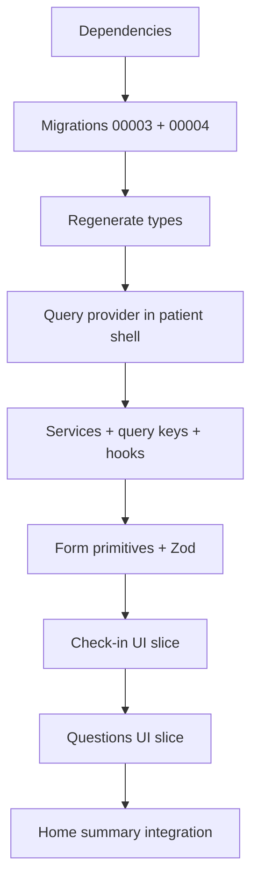

# Branch 2: Patient Check-ins & Questions

**Branch:** `feature/patient-checkins-questions`  
**Status:** Implemented  
**Depends on:** `feature/supabase-auth-roles` (completed)

Concrete implementation plan for the first patient CRUD vertical slices. For stable product context see [`docs/project-context.md`](../project-context.md). For domain rules see [`docs/domain-model.md`](../domain-model.md).

---

## Goal

Enable patients to:

1. Complete daily check-ins (pain, energy, mood, mobility, symptoms, optional note)
2. Create, view, edit, and delete their own open questions for caregivers

Using React Query, Zod validation, Supabase RLS, and integration into the existing patient dashboard.

---

## Scope

### Implement

- `patient_checkins` and `patient_questions` tables
- Patient-only RLS and explicit GRANT migrations
- React Query (patient dashboard only)
- Zod validation
- Services and hooks
- Check-in and questions UI on `/dashboard/checkin` and `/dashboard/questions`
- Live status on patient home (check-in reminder, open question count)

### Do not implement

- Caregiver dashboard or caregiver policies on patient data
- Restrictions, caregiver context
- Activities, planning, calendar
- AI agents (DailyBuddy, QuestionBuddy)
- Activity feedback
- Admin user management

---

## Planning decisions (branch 2)

| Decision | Choice |
|----------|--------|
| One check-in per day | **UI guides** toward one daily check-in; **no UNIQUE** constraint on `(patient_id, check_in_date)` yet |
| Check-in updates | Patients may update **their own** check-ins (RLS: own rows) |
| Check-in delete | **Not allowed** for patients |
| Question create | Patients create with `status = 'open'` |
| Question edit/delete | Only own **open** questions |
| `answer_notes` | Column exists; **caregiver writes in branch 3**; patients read-only |
| React Query scope | Patient dashboard only — do not wrap auth pages or unrelated app areas |
| CRUD transport | Browser Supabase client + RLS (matches auth form pattern); no service role on client |
| Route guard | Existing `requireRole("patient")` in `app/dashboard/layout.tsx` |

---

## Current baseline

Already in place from branch 1 and main:

- `app/dashboard/checkin/page.tsx` and `questions/page.tsx` — placeholders via `PatientSubPageView`
- `app/dashboard/layout.tsx` — `requireRole("patient")` + `PatientShell`
- UI primitives: `SectionHeader`, `DashboardCard`, `EmptyState`, `StatusBadge`, `PrimaryButton`
- Migration pattern: `supabase/migrations/00001_*.sql` (schema + RLS), `00002_*.sql` (GRANTs)
- **Not yet present:** `@tanstack/react-query`, `zod`, `lib/services/*`, `hooks/*`, domain tables

---

## Implementation order



Ship **check-ins first** as a fully testable slice, then questions.

---

## 1. Database migrations

### `00003_patient_checkins_questions.sql`

Schema, triggers, RLS. Idempotent style matching `00001`.

#### Table: `patient_checkins`

| Column | Type | Constraints |
|--------|------|-------------|
| `id` | uuid PK | `default gen_random_uuid()` |
| `patient_id` | uuid NOT NULL | FK → `profiles(id)` ON DELETE CASCADE |
| `check_in_date` | date NOT NULL | App supplies Europe/Amsterdam date |
| `pain_score` | smallint NOT NULL | CHECK 0–10 |
| `energy_level` | smallint NOT NULL | CHECK 1–5 |
| `mood` | smallint NOT NULL | CHECK 1–5 |
| `mobility_level` | smallint NOT NULL | CHECK 1–5 |
| `symptoms` | text NOT NULL | `default ''` |
| `note` | text | nullable |
| `created_at` | timestamptz | `default now()` |
| `updated_at` | timestamptz | `default now()` |

- Attach existing `set_updated_at()` trigger
- Index: `(patient_id, check_in_date DESC)`
- **No UNIQUE** on `(patient_id, check_in_date)` in this branch
- Table comment: documents future caregiver read access (branch 3)

#### Table: `patient_questions`

| Column | Type | Constraints |
|--------|------|-------------|
| `id` | uuid PK | `default gen_random_uuid()` |
| `patient_id` | uuid NOT NULL | FK → `profiles(id)` ON DELETE CASCADE |
| `question_text` | text NOT NULL | |
| `target_type` | text NOT NULL | CHECK IN (`doctor`, `nurse`, `physiotherapist`, `other`) |
| `status` | text NOT NULL | CHECK IN (`open`, `discussed`, `answered`); default `open` |
| `answer_notes` | text | nullable |
| `created_at` | timestamptz | `default now()` |
| `updated_at` | timestamptz | `default now()` |

- Attach `set_updated_at()` trigger
- Index: `(patient_id, status, created_at DESC)`

---

## 2. RLS policies

Enable RLS on both tables. All policies for role `authenticated`.

### `patient_checkins`

| Policy name | Command | USING | WITH CHECK |
|-------------|---------|-------|------------|
| `patient_checkins_select_own` | SELECT | `patient_id = auth.uid()` | — |
| `patient_checkins_insert_own` | INSERT | — | `patient_id = auth.uid()` |
| `patient_checkins_update_own` | UPDATE | `patient_id = auth.uid()` | `patient_id = auth.uid()` |

No DELETE policy.

### `patient_questions`

| Policy name | Command | USING | WITH CHECK |
|-------------|---------|-------|------------|
| `patient_questions_select_own` | SELECT | `patient_id = auth.uid()` | — |
| `patient_questions_insert_own` | INSERT | — | `patient_id = auth.uid()` AND `status = 'open'` |
| `patient_questions_update_own_open` | UPDATE | `patient_id = auth.uid()` AND `status = 'open'` | `patient_id = auth.uid()` AND `status = 'open'` |
| `patient_questions_delete_own_open` | DELETE | `patient_id = auth.uid()` AND `status = 'open'` | — |

**Deferred to branch 3:** caregiver SELECT; caregiver UPDATE of `status` and `answer_notes`.

**Application layer:** forms must not send `status` or `answer_notes` on patient create/update. RLS prevents status changes on non-open rows.

---

## 3. GRANTs

### `00004_patient_checkins_questions_grants.sql`

Explicit grants (same lesson as `00002_api_grants.sql`):

```sql
grant select, insert, update on public.patient_checkins to authenticated;
grant select, insert, update, delete on public.patient_questions to authenticated;

grant all on public.patient_checkins to service_role;
grant all on public.patient_questions to service_role;
```

After applying migrations, regenerate types:

```bash
npx supabase gen types typescript --project-id <ref> > types/database.ts
```

Add convenience exports in `types/database.ts` and domain aliases in `types/patient.ts`:

- `PatientCheckin`, `PatientQuestion`
- `CaregiverTargetType`, `QuestionStatus`
- Dutch label maps for UI

---

## 4. Dependencies

Add to `package.json`:

- `@tanstack/react-query`
- `zod`

---

## 5. React Query setup

### Provider

- `providers/query-provider.tsx` — client component, `QueryClientProvider`
- Defaults: `staleTime: 60_000`, `retry: 1`
- Wire inside **patient dashboard only** — e.g. `components/layout/patient-query-provider.tsx` used from `PatientShell`
- Do **not** add provider to root `app/layout.tsx` or auth routes

### Query keys

`lib/constants/query-keys.ts`:

```ts
checkIns: { all, today, recent }
questions: { all, openCount }
```

---

## 6. Services

`lib/services/` — async functions using `createClient()` from `lib/supabase/client.ts`.

### `patient-checkins.ts`

| Function | Description |
|----------|-------------|
| `getCheckInForDate(date)` | Single check-in for date (UI uses today) |
| `getRecentCheckIns(limit)` | History list, newest first |
| `createCheckIn(input)` | Insert; sets `patient_id` from session |
| `updateCheckIn(id, input)` | Update own row |

**UI note:** when multiple check-ins exist for the same date, UI shows the most recent and encourages edit instead of duplicate create.

### `patient-questions.ts`

| Function | Description |
|----------|-------------|
| `listQuestions()` | All own questions, ordered open first |
| `createQuestion(input)` | Insert with `status: open` |
| `updateQuestion(id, input)` | Update `question_text`, `target_type` only |
| `deleteQuestion(id)` | Delete open question |

Services throw on Supabase errors; hooks map to Dutch messages.

---

## 7. Hooks

| File | Hooks |
|------|-------|
| `hooks/use-patient-checkins.ts` | `useTodayCheckIn`, `useRecentCheckIns`, `useCreateCheckIn`, `useUpdateCheckIn` |
| `hooks/use-patient-questions.ts` | `usePatientQuestions`, `useCreateQuestion`, `useUpdateQuestion`, `useDeleteQuestion` |

**Invalidation**

- Check-in mutations → `checkIns.today`, `checkIns.recent`
- Question mutations → `questions.all`

---

## 8. Server / client boundaries

| File | Server | Client |
|------|--------|--------|
| `app/dashboard/layout.tsx` | `requireRole("patient")` | `PatientShell` + query provider |
| `app/dashboard/checkin/page.tsx` | Thin page | `CheckinView` |
| `app/dashboard/questions/page.tsx` | Thin page | `QuestionsView` |
| `app/dashboard/page.tsx` | Fetch `user` | `PatientHomeView` + `PatientHomeSummary` (client) |

No server actions for patient CRUD in this branch.

---

## 9. Validation (Zod)

### `lib/validations/patient-checkin.ts`

| Field | Rules |
|-------|-------|
| `check_in_date` | ISO date string |
| `pain_score` | int 0–10 |
| `energy_level`, `mood`, `mobility_level` | int 1–5 |
| `symptoms` | string, max 500, trimmed |
| `note` | optional string, max 1000 |

### `lib/validations/patient-question.ts`

| Field | Rules |
|-------|-------|
| `question_text` | trim, min 5, max 1000 |
| `target_type` | enum: doctor, nurse, physiotherapist, other |

### `lib/validations/error-messages.ts`

Map Zod issues to Dutch field errors.

Validate in forms before mutation; optional re-parse in services.

---

## 10. UI components

### Form primitives (`components/forms/`)

Match styling from `login-form.tsx` (`inputClasses` pattern):

| Component | Purpose |
|-----------|---------|
| `form-field.tsx` | Label, hint, error |
| `form-textarea.tsx` | Multi-line input |
| `form-select.tsx` | Target type dropdown |
| `pain-scale.tsx` | 0–10 touch-friendly control |
| `likert-scale.tsx` | 1–5 with Dutch labels |

### Check-in (`components/dashboard/`)

| Component | Purpose |
|-----------|---------|
| `checkin-view.tsx` | State machine: loading / empty / form / summary |
| `checkin-form.tsx` | Create and edit |
| `checkin-summary.tsx` | Read-only today card |
| `checkin-history-list.tsx` | Recent history (e.g. last 7 days) |

**UX flow**

1. Load today's check-in (if multiple for same date, use latest)
2. None → empty state + start form
3. Exists → summary + "Aanpassen" opens edit form
4. History below (read-only list; edit via selecting today)

**Dutch scale labels (examples)**

- Pain: *Geen pijn (0)* … *Ergste pijn (10)*
- Energy / mood / mobility: *Zeer slecht (1)* … *Uitstekend (5)*

### Questions (`components/dashboard/`)

| Component | Purpose |
|-----------|---------|
| `questions-view.tsx` | Page orchestration |
| `question-list.tsx` | Grouped list |
| `question-card.tsx` | Single question with badges and actions |
| `question-form.tsx` | Create / edit |

**UX flow**

- `SectionHeader` action: "Nieuwe vraag"
- Open: edit + delete (simple confirm)
- Discussed / answered: read-only; show `answer_notes` when present
- Target badges: Arts, Verpleging, Fysiotherapeut, Overig

### Home integration

| Component | Purpose |
|-----------|---------|
| `patient-home-summary.tsx` | Client card: today's check-in status, open question count |

Replace hardcoded reminder in `patient-home-view.tsx`.

Keep `PatientSubPageView` for `/dashboard/activities` and `/dashboard/advice` placeholders.

---

## 11. Manual testing checklist

### Setup

- [ ] Apply `00003` and `00004` (SQL Editor or `supabase db push`)
- [ ] Regenerate `types/database.ts`
- [ ] Test user has `patient` role in `user_roles`
- [ ] Schema Visualizer shows FK `patient_id` → `profiles`

### Check-ins

- [ ] `/dashboard/checkin` loads for patient
- [ ] Caregiver-only user cannot access `/dashboard` (redirect `/unauthorized`)
- [ ] Create check-in with all fields; summary shown
- [ ] UI discourages duplicate same-day entry (edit existing instead)
- [ ] Update check-in persists after refresh
- [ ] No delete action available; RLS blocks DELETE
- [ ] Home reminder reflects completion
- [ ] Invalid scores rejected in UI

### Questions

- [ ] Create question for each `target_type`
- [ ] Edit open question
- [ ] Delete open question
- [ ] Set `status = 'discussed'` in Supabase → patient cannot edit/delete
- [ ] Home shows open question count

### Security

- [ ] Patient A cannot read patient B rows
- [ ] INSERT with wrong `patient_id` fails
- [ ] Unauthenticated requests return no data
- [ ] Patient cannot set `answer_notes` or change `status` via client

### Regression

- [ ] Login, logout, role redirects work
- [ ] Activity and advice placeholders unchanged
- [ ] `npm run build` passes

---

## 12. Suggested commit breakdown

Each commit should leave the app runnable.

| # | Message | Scope |
|---|---------|-------|
| 1 | `chore: add react-query and zod dependencies` | `package.json`, lockfile |
| 2 | `feat(db): add patient checkins and questions schema` | `00003` migration |
| 3 | `feat(db): grant API access to patient tables` | `00004` migration |
| 4 | `feat(types): add patient domain types and database exports` | `types/database.ts`, `types/patient.ts` |
| 5 | `feat(data): add check-in and question services and query keys` | `lib/services/*`, `lib/constants/query-keys.ts` |
| 6 | `feat(hooks): add React Query hooks for patient CRUD` | `hooks/*`, query provider, patient shell |
| 7 | `feat(forms): add shared form primitives and zod validations` | `components/forms/*`, `lib/validations/*` |
| 8 | `feat(dashboard): implement daily check-in flow` | check-in views, page |
| 9 | `feat(dashboard): implement patient questions CRUD` | question views, page |
| 10 | `feat(dashboard): show live status on patient home` | `patient-home-summary.tsx` |

---

## 13. Post-implementation

Update [`docs/domain-model.md`](../domain-model.md):

- Mark `patient_checkins` and `patient_questions` as **Implemented**
- Note any field or rule changes discovered during build

Prepare branch 3 by documenting deferred caregiver RLS policies in domain model.

---

## 14. Follow-up work (after branch 2)

### Motivation + evening evaluation data (done on feature branch)

- `motivation_score` on `patient_checkins` (migrations `00005`)
- `patient_participation_evaluations` table (migrations `00006`, `00007`)
- Evening evaluation: services + hooks only; UI deferred

### Participation scheduling (deferred)

The app tracks **calendar days** (Europe/Amsterdam), not morning/evening **time windows**. No evening reminders on the home dashboard yet.

When implementing scheduling, follow:

**[`docs/future-participation-scheduling.md`](../future-participation-scheduling.md)**

That document covers current behaviour, intended daily rhythm, suggested `getParticipationPhase()` helper, home-card copy, and files to touch.

Also listed in [`DEFERRED.md`](../../DEFERRED.md).

---

## Related files (existing)

| Path | Role |
|------|------|
| `app/dashboard/layout.tsx` | Patient route guard |
| `app/dashboard/checkin/page.tsx` | Check-in route placeholder |
| `app/dashboard/questions/page.tsx` | Questions route placeholder |
| `components/dashboard/patient-sub-page-view.tsx` | Placeholder shell |
| `components/forms/login-form.tsx` | Form styling reference |
| `supabase/migrations/00001_auth_profiles_roles.sql` | RLS pattern reference |
| `supabase/migrations/00002_api_grants.sql` | GRANT pattern reference |
