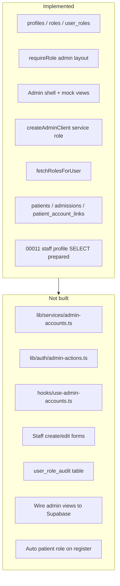
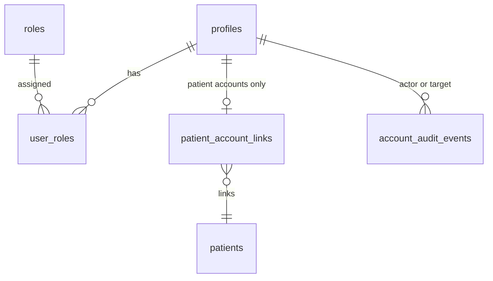

# Branch plan — feature/admin-account-management

**Branch:** `feature/admin-account-management`  
**Depends on:** `feature/account-domain-model` (merged)  
**Durable source:** [`docs/branch-plans/branch-admin-account-management.md`](docs/branch-plans/branch-admin-account-management.md) (to be created on implementation start)  
**Design notes:** [`docs/future-admin-users-roles.md`](docs/future-admin-users-roles.md)

---

## 1. Branch objective

Deliver a complete **administrative account management vertical slice** so hospital administrators can manage the lifecycle of **staff login accounts** and oversee **patient-linked login accounts** — without introducing new domain entities or redesigning the account model shipped in branch 4.

**In one sentence:** Replace mock `/admin` pages with real, service-role-backed CRUD for staff accounts, role assignment, activation/deactivation, and read-only patient-account visibility — building on `profiles` + `user_roles` as the staff identity model.

**Success criteria:**
- Admins can list, create, edit, activate/deactivate staff accounts and assign/revoke roles.
- Self-registration at `/register` reliably assigns the `patient` role (no more `/unauthorized` for new patients).
- Caregiver audit UI (`updated_by_staff_id` → display name) resolves real staff names after migration `00011` is applied.
- All mutations go through `requireRole("admin")` server actions using `createAdminClient()` — never client-side `user_roles` writes.
- Patient account linking flow and clinical patient/admission CRUD remain out of scope.

---

## 2. Functional requirements

### 2.1 Staff account management (primary)

| ID | Requirement |
|----|-------------|
| FR-S1 | Admin can view a paginated/filterable list of **staff accounts** (profiles with at least one of: `caregiver`, `activity_coordinator`, `admin`). |
| FR-S2 | Admin can **create** a staff account with required `full_name`, email, and one or more staff roles. Account is created via Supabase Auth Admin API (invite or create-with-password); not via public `/register`. |
| FR-S3 | Admin can **edit** staff `full_name` and `preferred_language`. |
| FR-S4 | Admin can **assign and revoke** staff roles (`caregiver`, `activity_coordinator`, `admin`) via multi-select. Staff may hold multiple roles. |
| FR-S5 | Admin can **deactivate** a staff account (blocks login) and **reactivate** it. |
| FR-S6 | Staff accounts must have a non-empty `full_name` (validation enforced on create/update). |
| FR-S7 | Admin cannot remove their own last `admin` role or deactivate their own account. |

### 2.2 Patient-linked accounts overview (read-only)

| ID | Requirement |
|----|-------------|
| FR-P1 | Admin can view a separate list (tab or sub-route) of accounts with the `patient` role. |
| FR-P2 | Each row shows login identity (`full_name`, email), link status (linked / not linked), and linked clinical patient name/id when `patient_account_links` exists. |
| FR-P3 | No create/edit/link/unlink actions in this branch — linking remains branch 6 (`feature/patient-admission-management`). |

### 2.3 Registration and onboarding fix

| ID | Requirement |
|----|-------------|
| FR-R1 | Public `/register` assigns the `patient` role automatically after successful signup. |
| FR-R2 | Staff accounts created by admin must **not** receive the `patient` role by default. |
| FR-R3 | Every authenticated user must have at least one role before post-login redirect (existing `/unauthorized` guard stays as safety net). |

### 2.4 Administrator workflow and overview

| ID | Requirement |
|----|-------------|
| FR-A1 | `/admin` dashboard shows real counts: total staff, active/inactive staff, role distribution, recent role changes. |
| FR-A2 | `/admin/roles` shows the seeded role catalog (read-only) with live user counts per role. |
| FR-A3 | `/admin/users` is the primary staff management surface; patient accounts accessible via filter/tab. |
| FR-A4 | User detail/edit at `/admin/users/[userId]` (drawer or dedicated page). |

### 2.5 Audit

| ID | Requirement |
|----|-------------|
| FR-AU1 | Role assignments and revocations are recorded in an audit table (who changed what, when, target user). |
| FR-AU2 | Account activation/deactivation events are recorded. |
| FR-AU3 | Audit log is admin-readable only (server-side); no client INSERT. |

### 2.6 Preparation for future department/team assignments

| ID | Requirement |
|----|-------------|
| FR-D1 | No department/team tables or access rules in this branch. |
| FR-D2 | Service layer exposes a clear `StaffAccountSummary` type with an optional `departmentId: null` placeholder and a documented extension point for a future branch. |
| FR-D3 | Do not add organizational RLS or caregiver scoping. |

### Explicitly out of scope

- Caregiver creating clinical patients or admissions
- Patient link code generation / redemption UI
- Department/team access control
- AI agents, planning module features
- SSO, password reset email customization beyond Supabase defaults
- Settings page (`/admin/settings` nav item stays pointed at `/admin` or is removed)

---

## 3. Technical approach

### 3.1 Current state (gap analysis)



| Layer | Exists today | Gap |
|-------|--------------|-----|
| DB schema | `profiles`, `roles`, `user_roles`; no `is_active`; no audit table | Apply `00011`; add audit table; optional `assign_patient_role` trigger |
| RLS | Clients read own profile/roles only; no admin SELECT policies | **Intentionally unchanged** — admin reads/writes via service role in server actions |
| Services | Patient/care services only | New `lib/services/admin-accounts.ts` |
| Auth | `resolvePostLoginRedirect`, `requireRole` | Admin server actions; patient role on register |
| UI | Mock data in [`admin-users-view.tsx`](components/dashboard/admin-users-view.tsx), [`admin-roles-view.tsx`](components/dashboard/admin-roles-view.tsx) | Real data, forms, detail route |
| Types | Generated `Profile`, `Role`, `UserRole` | Domain DTOs in `types/admin-account.ts` |

**Key architectural invariant (from domain model):** Staff are **not** a separate entity. A staff account is a `profiles` row with staff role(s) in `user_roles`. Patient accounts are `profiles` rows with `patient` role, optionally linked via `patient_account_links`.

### 3.2 Mutation path (all admin writes)

```
Admin UI (client)
  → server action (requireRole("admin"))
    → lib/services/admin-accounts.ts
      → createAdminClient()
        → auth.admin.* (create/invite/ban)
        → public.profiles / user_roles (via service role)
        → account_audit_events (via service role)
```

**No** new authenticated RLS policies for `user_roles` INSERT/DELETE — privilege escalation risk remains blocked at DB level.

### 3.3 Read path

- **Staff/patient account lists:** Server action or server component loader calls service layer → Auth Admin `listUsers` (paginated) joined with `profiles`, `user_roles`, `roles`, and optionally `patient_account_links` + `patients`.
- **Role catalog:** Direct `roles` SELECT via service role + aggregated counts.
- **Alternative considered:** `list_admin_accounts()` SECURITY DEFINER RPC (mirrors `list_care_patients()`). **Rejected for MVP** — email lives in `auth.users`, not public schema; service-layer join via Admin API is simpler and keeps auth data out of Postgres RPCs.

### 3.4 Staff vs patient role assignment strategy

Use **Supabase `app_metadata.account_type`** to distinguish account origins:

| Origin | `app_metadata.account_type` | Default roles |
|--------|----------------------------|---------------|
| Public `/register` | `"patient"` (set in signup options) | `patient` (DB trigger or immediate server insert) |
| Admin staff create | `"staff"` | Staff roles assigned in same server action; **no** `patient` role |

Extend `handle_new_user()` (migration `00028`) to auto-insert `patient` role when `account_type` is absent or `"patient"`. Admin staff creation sets `account_type: "staff"` and assigns roles in the server action.

### 3.5 Activation model

Use **Supabase Auth ban** (`auth.admin.updateUserById` with `ban_duration`) as the source of truth for active/inactive:
- Active: `banned_until` is null or in the past
- Inactive: user is banned

Mirror status in list DTOs; no `profiles.is_active` column needed for MVP.

### 3.6 Downstream fix: caregiver audit names

Apply prepared migration [`00011_profiles_select_staff_for_caregivers.sql`](supabase/migrations/00011_profiles_select_staff_for_caregivers.sql). [`lib/services/patient-context.ts`](lib/services/patient-context.ts) already joins `updated_by_staff_id` → `profiles.full_name`; real names appear once staff have `full_name` set and migration is live.

---

## 4. Database changes

Next migration sequence starts at **`00028`** (after `00027`).

| Seq | File | Purpose |
|-----|------|---------|
| 1 | `00028_profiles_staff_select_and_patient_role.sql` | Apply `profiles_select_staff_for_caregivers` policy (from `00011`); extend `handle_new_user()` to auto-assign `patient` role when `app_metadata.account_type` is not `'staff'` |
| 2 | `00029_account_audit_events.sql` | `account_audit_events` table + grants; optional trigger on `user_roles` for defense-in-depth (primary writes still from service layer with explicit audit rows) |
| 3 | `00030_backfill_patient_roles.sql` | Idempotent: assign `patient` role to existing profiles that have a `patient_account_links` row or were backfilled in `00018` but lack the role |

### `account_audit_events` (proposed shape)

| Column | Type | Notes |
|--------|------|-------|
| `id` | uuid PK | |
| `actor_user_id` | uuid FK → profiles | Admin who performed the action |
| `target_user_id` | uuid FK → profiles | Account affected |
| `action` | text | CHECK: `role_assigned`, `role_revoked`, `profile_updated`, `account_created`, `account_deactivated`, `account_reactivated` |
| `metadata` | jsonb | e.g. `{ "role": "caregiver" }`, `{ "field": "full_name" }` |
| `created_at` | timestamptz | |

RLS: enabled, **no authenticated policies** (service role only). Explicit GRANT to `service_role`.

### `handle_new_user()` extension (sketch)

```sql
-- After profile insert, when account_type != 'staff':
insert into public.user_roles (user_id, role_id)
select new.id, r.id from public.roles r where r.name = 'patient'
on conflict do nothing;
```

Guard: only when `coalesce(new.raw_app_meta_data->>'account_type', 'patient') <> 'staff'`.

### RLS changes summary

| Change | Required? | Rationale |
|--------|-----------|-----------|
| Apply `profiles_select_staff_for_caregivers` | **Yes** | Unblocks caregiver audit name display |
| Admin SELECT on all `profiles` | **No** | Admin reads via service role |
| Client `user_roles` INSERT/DELETE | **No** | Keep blocked |
| New department/team policies | **No** | Deferred |

Regenerate [`types/database.ts`](types/database.ts) after each applied migration.

---

## 5. Backend / services

### 5.1 New files

| File | Responsibility |
|------|----------------|
| [`lib/services/admin-accounts.ts`](lib/services/admin-accounts.ts) | List/create/update staff; list patient accounts; role assign/revoke; activate/deactivate; audit writes |
| [`lib/auth/admin-actions.ts`](lib/auth/admin-actions.ts) | `"use server"` wrappers: `requireRole("admin")` + revalidate paths |
| [`lib/validations/admin-account.ts`](lib/validations/admin-account.ts) | Zod schemas: create staff, update profile, role set |
| [`types/admin-account.ts`](types/admin-account.ts) | `StaffAccountSummary`, `PatientAccountSummary`, `RoleWithCount`, `AccountAuditEvent` |
| [`lib/constants/admin-account-copy.ts`](lib/constants/admin-account-copy.ts) | Dutch UI labels for roles (`caregiver` → "Zorgverlener", etc.) |

### 5.2 Service functions (proposed signatures)

```typescript
// lib/services/admin-accounts.ts
listStaffAccounts(options?: { search?: string; status?: "active" | "inactive" }): Promise<StaffAccountSummary[]>
listPatientAccounts(options?: { linkStatus?: "linked" | "unlinked" | "all" }): Promise<PatientAccountSummary[]>
getAccountById(userId: string): Promise<StaffAccountSummary | PatientAccountSummary>
createStaffAccount(input: CreateStaffAccountInput): Promise<{ userId: string }>
updateAccountProfile(userId: string, input: UpdateProfileInput, actorId: string): Promise<void>
setUserRoles(userId: string, roleNames: RoleName[], actorId: string): Promise<void>
setAccountActive(userId: string, active: boolean, actorId: string): Promise<void>
listRolesWithCounts(): Promise<RoleWithCount[]>
listRecentAuditEvents(limit?: number): Promise<AccountAuditEvent[]>
getAdminOverviewStats(): Promise<AdminOverviewStats>
```

### 5.3 Registration change

Refactor [`components/forms/register-form.tsx`](components/forms/register-form.tsx) to call a new server action `registerPatientAccount()` that:
1. Sets `options.data.account_type: "patient"` in signup metadata (or `app_metadata` via admin if using server-side signUp)
2. Relies on `handle_new_user` trigger for role assignment (or explicitly inserts role if trigger timing is insufficient)

Prefer **server action wrapping `signUp`** so role assignment is reliable regardless of email-confirmation flow.

### 5.4 Admin staff creation

`createStaffAccount()`:
1. `auth.admin.createUser` or `inviteUserByEmail` with `app_metadata: { account_type: "staff" }` and `user_metadata: { full_name }`
2. Upsert `profiles.full_name` if trigger left it empty
3. Insert `user_roles` for selected staff roles
4. Write `account_audit_events` row

### 5.5 Safety guards (service layer)

- Reject `setUserRoles` that would leave target with zero roles
- Reject self-demotion from last `admin`
- Reject self-deactivation
- Reject assigning `patient` role to staff accounts (or auto-strip `patient` when assigning any staff role)
- Validate at least one staff role on staff account create

### 5.6 Query keys

Add to [`lib/constants/query-keys.ts`](lib/constants/query-keys.ts):

```typescript
adminAccounts: { all: ["admin-accounts"], staff: ..., patients: ..., detail: (id) => ... }
adminRoles: { all: ["admin-roles"] }
adminAudit: { recent: ["admin-audit"] }
```

---

## 6. Frontend / UI

### 6.1 Routes

| Route | Change |
|-------|--------|
| [`app/admin/page.tsx`](app/admin/page.tsx) | Replace mock stats with server-fetched overview |
| [`app/admin/users/page.tsx`](app/admin/users/page.tsx) | Staff list + tab for patient accounts |
| [`app/admin/users/[userId]/page.tsx`](app/admin/users/[userId]/page.tsx) | **New** — account detail/edit |
| [`app/admin/roles/page.tsx`](app/admin/roles/page.tsx) | Wire to real role catalog |

### 6.2 Components

| Component | Purpose |
|-----------|---------|
| Refactor [`admin-users-view.tsx`](components/dashboard/admin-users-view.tsx) | Staff table with search, status badge, role chips, row link to detail |
| **New** `admin-patient-accounts-view.tsx` | Read-only patient account table with link status |
| **New** `admin-user-detail-view.tsx` | Edit form: name, language, roles, activate/deactivate |
| **New** `admin-create-staff-form.tsx` in `components/forms/` | Modal or page form for staff creation |
| Refactor [`admin-roles-view.tsx`](components/dashboard/admin-roles-view.tsx) | Map `RoleName` to Dutch labels; show real counts |
| **New** `admin-overview-cards.tsx` | Dashboard stat cards |

### 6.3 Hooks

| Hook | Purpose |
|------|---------|
| `hooks/use-admin-staff-accounts.ts` | React Query list + mutations |
| `hooks/use-admin-patient-accounts.ts` | React Query read-only list |
| `hooks/use-admin-roles.ts` | Role catalog with counts |
| `hooks/use-admin-account-detail.ts` | Single account fetch + update mutations |

### 6.4 UX conventions (from workspace rules)

- Tablet-first, large touch targets, card-based layouts
- Replace mock Dutch role names ("Verpleegkundige", "Planner", "Vrijwilliger") with canonical `RoleName` labels from copy constants
- Status badges: Actief / Inactief (from Auth ban state)
- Confirm dialogs for deactivation and role removal
- "Gebruiker toevoegen" opens staff create flow (staff only — not patient creation)

### 6.5 Optional polish (end of branch)

- Multi-role module switcher in [`DashboardShell`](components/layout/dashboard-shell.tsx) when user holds e.g. `admin` + `caregiver` (per [`project-context.md`](docs/project-context.md)) — small, non-blocking

---

## 7. Security / RLS considerations

| Concern | Mitigation |
|---------|------------|
| Privilege escalation via client `user_roles` writes | Keep RLS deny on INSERT/UPDATE/DELETE for `authenticated` on `user_roles` |
| Admin operations exposed to non-admins | Every server action calls `requireRole("admin")` |
| Service role key exposure | Only in server actions / services; never import `createAdminClient` in client components |
| Self-lockout | Service guards: cannot remove own last admin role; cannot deactivate self |
| Staff reading all profiles | `profiles_select_staff_for_caregivers` is scoped to profiles **with staff roles** — not all profiles |
| Patient PII in admin list | Admin role already has `patient_account_links_select_staff` and `patients_select_staff` RLS — read-only overview is authorized |
| Audit integrity | `account_audit_events` writable only by service role; append-only (no UPDATE/DELETE policies) |
| Email enumeration | Admin-only routes; acceptable for internal hospital admin tool |

**RLS philosophy for this branch:** Add the minimum policy needed (`00011` staff name reads). Do **not** add broad `profiles_select_admin` — admin aggregation stays server-side with service role, matching [`docs/future-admin-users-roles.md`](docs/future-admin-users-roles.md).

---

## 8. Incremental implementation phases

### Phase 1 — Database foundation
- Apply `00028` (staff profile SELECT + patient role trigger)
- Apply `00029` (audit table)
- Apply `00030` (backfill patient roles for existing linked accounts)
- Regenerate types; `tsc --noEmit`

### Phase 2 — Service layer + server actions
- `types/admin-account.ts`, validations, `admin-accounts.ts` service
- `admin-actions.ts` with all mutations and list loaders
- Unit-test service guards (optional, if time permits)

### Phase 3 — Patient registration fix
- Server action for register + `account_type: patient`
- Verify new signup → `patient` role → `/dashboard` redirect

### Phase 4 — Admin staff UI (core)
- Wire staff list, create form, detail/edit, role multi-select, activate/deactivate
- Replace mock data in `admin-users-view.tsx`

### Phase 5 — Patient accounts overview + roles page
- Patient accounts tab (read-only)
- Roles catalog with counts
- Admin overview dashboard with real stats + recent audit

### Phase 6 — Integration verification + docs
- Verify caregiver Zorgcontext shows real `updated_by_staff_id` name
- Update [`docs/domain-model.md`](docs/domain-model.md) blueprint status for admin-managed roles
- Update [`docs/future-admin-users-roles.md`](docs/future-admin-users-roles.md) → implemented / archive
- Add [`docs/branch-plans/branch-admin-account-management.md`](docs/branch-plans/branch-admin-account-management.md) as shipped record

---

## 9. Risks

| Risk | Impact | Mitigation |
|------|--------|------------|
| Email confirmation delays patient role assignment | User hits `/unauthorized` before role exists | Assign role in `handle_new_user` trigger (sync with profile creation), not only post-confirm callback |
| Admin creates staff via public `/register` | Staff gets `patient` role | Document ops procedure; optionally restrict `/register` copy to patients; `account_type: staff` only via admin API |
| Auth Admin API pagination limits | Incomplete user lists | Paginate `listUsers` in service; consider search by email |
| Removing all roles from a user | Broken login redirect | Service guard: minimum one role; DB check optional |
| Migration `00011` not yet on remote | Audit names still show fallback | Verify applied status before branch sign-off |
| Ban vs soft-delete semantics | Confusion with "Inactief" badge | Document that deactivation is Auth-level; profile row remains |
| Multi-role nav not shipped | Staff with admin+caregiver only land on `/admin` | Optional polish phase; document as known limitation |

---

## 10. Suggested commit sequence

| # | Commit message (intent) | Scope |
|---|-------------------------|-------|
| 1 | `feat(db): apply staff profile RLS and patient role on signup` | `00028`, types regen |
| 2 | `feat(db): add account audit events table` | `00029`, types regen |
| 3 | `feat(db): backfill patient role for linked accounts` | `00030` |
| 4 | `feat(admin): add account types, validations and service layer` | `types/admin-account.ts`, `lib/validations/`, `lib/services/admin-accounts.ts`, copy constants |
| 5 | `feat(admin): add secured server actions for account management` | `lib/auth/admin-actions.ts` |
| 6 | `fix(auth): assign patient role on self-registration` | Register server action + form wiring |
| 7 | `feat(admin): wire staff accounts list and create flow` | Users page, hooks, create form |
| 8 | `feat(admin): add user detail edit, roles and activation` | `[userId]` route, detail view, mutations |
| 9 | `feat(admin): add patient accounts overview and roles catalog` | Patient tab, roles view, overview stats |
| 10 | `docs: record admin account management branch plan and update domain model` | Branch plan doc, domain-model + future-admin doc updates |

---

## Reference: entity model (unchanged)



Staff account = `profiles` + staff `user_roles`. No `staff_accounts` table.
