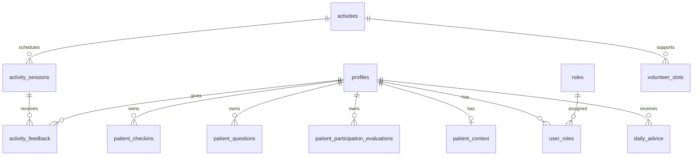

# OpnameBuddy — Domain Model

Living domain model and data blueprint. This document evolves with each feature branch.

> **Note:** Sections marked *Blueprint* describe intended tables and fields at planning level. They are not final SQL. Migrations in `supabase/migrations/` are the source of truth once applied.

---

## How to read this document

For each area:

1. **User / problem** — who needs this and why
2. **Entity** — the concept in the domain
3. **Ownership & relationships** — who owns data and how entities connect
4. **Business rules** — constraints the application must enforce
5. **Blueprint** — expected database shape (living, not final)

---

## Identity and access

> **Upcoming refactor (current priority — docs only, not yet implemented):**
> The account/domain model is being refactored to separate three concerns that the current schema still blurs. See **Current development priority** in [`docs/project-context.md`](project-context.md).
>
> - **Login identity vs clinical patient identity are distinct.** `profiles` / `auth.users` model **login accounts**; a new **`patients`** entity will model the **clinical patient**.
> - **`roles` / `user_roles` determine what an account may do** and stay separate from domain data.
> - **Patient-owned care data belongs to a patient/admission, not to a staff login.** Care restrictions, care context, check-ins, questions, daily plans, and AI advice are owned by the clinical patient/admission. Staff appear only through audit fields such as `created_by_staff_id` / `updated_by_staff_id`.
> - **Staff/caregiver accounts are actors, not owners** of patient-owned data.
> - **Patient accounts may later be linked to existing patient records** via a secure linking flow.
>
> Blueprints below still describe the pre-refactor shape (e.g. `patient_id` referencing `profiles` / `auth.uid()`). They will be revised as the refactor lands. No migrations are applied for this refactor yet.
>
> **Foundation branch:** the ownership map, table inventory, and planned migration sequence for this refactor live in [`docs/branch-plans/branch-account-domain-model.md`](branch-plans/branch-account-domain-model.md). The four care tables (`patient_context`, `patient_checkins`, `patient_questions`, `patient_participation_evaluations`) still use the profile-based model (`patient_id → profiles`, RLS `patient_id = auth.uid()`) and are unchanged in this commit.

### User / problem

Everyone using OpnameBuddy authenticates via Supabase Auth. The app needs display names, language preference, and role-based module access without exposing the `auth` schema to client queries.

The refactor adds a further requirement: the system must also represent the **clinical patient** as its own entity, distinct from the login account that authenticates. A login identity is *who is acting*; a clinical patient is *who the care data is about*.

### Entity: Profile

App-specific user record, 1:1 with `auth.users`.

| Concern | Detail |
|---------|--------|
| Ownership | Each user owns their profile row |
| Relationships | Referenced by all `patient_id` and staff attribution fields |

**Business rules**

- Created automatically on signup via `handle_new_user()` trigger
- Clients may read and update their own profile only (RLS)
- No client-side INSERT or DELETE on profiles

### Entity: Role and UserRole

Canonical role names and assignments.

| Concern | Detail |
|---------|--------|
| Ownership | Role catalog is system-managed; assignments are admin-managed |
| Relationships | `user_roles` links `profiles` ↔ `roles` |

**Business rules**

- Role names: `patient`, `caregiver`, `activity_coordinator`, `admin`
- Clients may read their own role assignments only
- Clients cannot assign or remove roles (prevents privilege escalation)
- Staff may have multiple roles; patients normally have only `patient`

### Blueprint: implemented tables

| Table | Key fields | Status |
|-------|------------|--------|
| `profiles` | `id`, `full_name`, `preferred_language`, timestamps | Implemented |
| `roles` | `id`, `name` | Implemented |
| `user_roles` | `user_id`, `role_id`, `created_at` | Implemented |

---

## Patient participation

### Daily check-in

#### User / problem

Patients need a simple daily moment to reflect on how they feel. Structured input supports caregiver review and later DailyBuddy advice without requiring medical self-diagnosis.

#### Entity: PatientCheckin

A patient-owned reflection about physical and emotional state on a given day.

| Concern | Detail |
|---------|--------|
| Ownership | `patient_id` = authenticated patient |
| Relationships | Belongs to `profiles` (patient) |

**Business rules**

- Captures: pain, energy, mood, mobility, **motivation for activity participation**, symptoms, optional note
- UI encourages **one check-in per day**; database does **not** yet enforce uniqueness on `(patient_id, check_in_date)` — flexibility for MVP iteration
- Patients may **create** and **update** their own check-ins
- Patients may **not delete** check-ins (audit trail for caregivers and AI)
- Caregivers review check-ins in branch 3; patients only CRUD in branch 2

#### Blueprint: `patient_checkins` (branch 2 — **Implemented**)

| Field | Type (planned) | Notes |
|-------|----------------|-------|
| `id` | uuid PK | |
| `patient_id` | uuid FK → profiles | `auth.uid()` on insert |
| `check_in_date` | date | App uses Europe/Amsterdam calendar day |
| `pain_score` | smallint | 0–10 |
| `energy_level` | smallint | 1–5 |
| `mood` | smallint | 1–5 |
| `mobility_level` | smallint | 1–5 |
| `motivation_score` | smallint | 1–5; how motivated to participate in an activity today |
| `symptoms` | text | Free-text; empty string if none |
| `note` | text | Optional reflection |
| `created_at`, `updated_at` | timestamptz | `set_updated_at` trigger |

Index planned on `(patient_id, check_in_date DESC)` for history lists. No UNIQUE on date pair yet.

---

### Patient question

#### User / problem

Patients forget important questions before rounds, visits or care moments. They need a simple **preparation editor**: write a question whenever it comes to mind, label it for the right **hospital specialism**, and keep it until they can discuss it with a caregiver.

**Branch 2:** editor + list only. Questions are **not** organized or summarized in the app yet.

**Branch 8 (QuestionBuddy):** open questions are organized into a **daily summary** (grouped by specialism, clearer wording) for use before rounds. The AI **never answers** medical questions — only organizes. See [`docs/future-questionbuddy-daily-summary.md`](../future-questionbuddy-daily-summary.md).

#### Entity: PatientQuestion

A question the patient wants to discuss with a specific caregiver specialism.

| Concern | Detail |
|---------|--------|
| Ownership | `patient_id` = authenticated patient |
| Relationships | Belongs to `profiles` (patient) |

**Business rules**

- Target types (specialism): `doctor`, `nurse`, `physiotherapist`, `other`
- Status lifecycle: `open` → `discussed` → `answered`
- Patients may **create** questions (default status `open`)
- Patients may **edit** and **delete** only their own **open** questions
- `answer_notes` is reserved for **caregiver** use (branch 3); patients may read it when populated
- **No in-app daily summary in branch 2** — QuestionBuddy (branch 8) produces an organized daily list from open questions; it does not answer them

#### Blueprint: `patient_questions` (branch 2 — **Implemented**)

| Field | Type (planned) | Notes |
|-------|----------------|-------|
| `id` | uuid PK | |
| `patient_id` | uuid FK → profiles | |
| `question_text` | text | Required |
| `target_type` | text | CHECK: doctor, nurse, physiotherapist, other |
| `status` | text | CHECK: open, discussed, answered; default open |
| `answer_notes` | text | Nullable; caregiver writes in branch 3 |
| `created_at`, `updated_at` | timestamptz | |

---

### Participation evaluation (evening)

#### User / problem

After trying a suggested or planned activity, patients need a quick evening reflection on what they did and how it felt. This informs future DailyBuddy recommendations and complements morning motivation.

#### Entity: PatientParticipationEvaluation

A patient-owned reflection on participation in one activity on a given day.

| Concern | Detail |
|---------|--------|
| Ownership | `patient_id` = authenticated patient |
| Relationships | Belongs to `profiles`; optional `activity_session_id` when activities exist (branch 4) |

**Business rules**

- Status: `done`, `partly_done`, `not_done`
- `activity_title` holds a human-readable label until activity sessions exist
- Patients may **create** and **update** their own evaluations
- Patients may **not delete** evaluations
- UI polish deferred; data layer implemented first

#### Blueprint: `patient_participation_evaluations` (**Implemented**)

| Field | Type | Notes |
|-------|------|-------|
| `id` | uuid PK | |
| `patient_id` | uuid FK → profiles | |
| `evaluation_date` | date | Europe/Amsterdam calendar day |
| `activity_title` | text | Label from DagBuddy suggestion or patient input |
| `activity_session_id` | uuid | Nullable; FK in branch 4 |
| `status` | text | done, partly_done, not_done |
| `reason` | text | Optional; especially when partly_done or not_done |
| `effort_score` | smallint | 1–5 |
| `after_feeling_score` | smallint | 1–5; how patient feels after |
| `notes` | text | Optional |
| `created_at`, `updated_at` | timestamptz | |

**Scheduling (deferred):** The app does not yet distinguish morning vs evening by clock time — only by calendar date. See [`docs/future-participation-scheduling.md`](../future-participation-scheduling.md).

---

## Caregiver safety and context

### Patient context (Zorgcontext)

#### User / problem

Caregivers record **practical care facts** so DagBuddy and activity filtering can apply predefined safety rules. The form stores facts — not derived planning decisions such as volunteer eligibility or max activity intensity.

#### Entity: PatientContext

A caregiver-maintained snapshot of functional care context for one patient. One row per patient (upsert).

| Concern | Detail |
|---------|--------|
| Ownership | Written by caregivers; read by patient (own row), caregivers, activity coordinators, and later AI tools |
| Relationships | Belongs to patient (`profiles`); `updated_by` tracks last caregiver |

**Business rules**

- All enum fields include **`unknown`** as an intentional value — never interpreted as “no” or “safe”
- **Facts only** — volunteer suitability, intensity limits, and duration limits are derived later by DagBuddy from context + check-in + activity requirements
- Mobility aid fields are conditional on `mobility_status` (`walking_with_aid`, `wheelchair`)
- Additional attention points use `text[]` chips — non-critical, do not block completeness
- Living record: caregivers update in place as admission evolves (`updated_at`, `updated_by`)
- Patients may **read** their own context; they cannot edit it

**Critical completeness fields:**

- `mobility_status`, `transfer_support`, `fall_risk`, `requires_supervision` (Begeleiding), `isolation_type`, `room_restriction` (Bewegingsvrijheid)
- `mobility_aid_available` when mobility status requires an aid
- Attention chips and notes do **not** block completeness

#### Blueprint: `patient_context` (branch 3 — **Implemented**)

| Field | Type | Notes |
|-------|------|-------|
| `id` | uuid PK | |
| `patient_id` | uuid FK → profiles | UNIQUE |
| `mobility_status` | text | unknown, bed_bound, chair_only, wheelchair, walking_independent, walking_with_aid, walking_with_assistance |
| `transfer_support` | text | unknown, none, one_person, two_person, lift |
| `fall_risk` | text | unknown, low, medium, high |
| `requires_supervision` | text | unknown, not_required, required (UI: Begeleiding) |
| `mobility_aid_type` | text | Conditional; unknown, cane, walker, wheelchair, own_aid, other |
| `mobility_aid_available` | text | Conditional critical; unknown, yes, no |
| `isolation_type` | text | unknown, none, contact, droplet, airborne, strict, protective |
| `room_restriction` | text | unknown, room_only, ward_only, no_restriction (UI: Bewegingsvrijheid) |
| `additional_attention_points` | text[] | iv_pump, oxygen, catheter, wound_or_drain, post_surgery, fatigue, wandering_risk, language_barrier, cognitive_support, hearing_support, vision_support, communication_support, other |
| `additional_attention_notes` | text | Optional; UI when `other` chip selected |
| `notes` | text | Optional caregiver notes |
| `updated_by` | uuid FK → profiles | Caregiver who last saved |
| `created_at`, `updated_at` | timestamptz | `set_updated_at` trigger |

**Removed fields (migration `00012`):** `weight_bearing_status`, `has_iv_line`, `has_oxygen` — IV/oxygen captured via attention chips.

**Deprecated blueprints:** separate `patient_restrictions` (boolean flags) and `caregiver_contexts` (free text only) — superseded by unified `patient_context`.

---

## Activities and planning

### Activity

#### User / problem

Activity coordinators need a reusable catalog of non-medical recovery participation options to schedule for patients.

#### Entity: Activity

Template for a participation activity (not a scheduled instance).

Examples: short walk, breathing exercise, chair exercise, social coffee moment, relaxation activity, creative activity.

| Concern | Detail |
|---------|--------|
| Ownership | Managed by activity coordinators |
| Relationships | Parent of activity sessions |

**Business rules**

- Non-medical participation only
- Properties may include type, intensity, location, supervision required, and where it can be done (bed, chair, room, ward, outside)

#### Blueprint: `activities` (branch 4)

| Field | Type (planned) | Notes |
|-------|----------------|-------|
| `id` | uuid PK | |
| `title`, `description` | text | |
| `activity_type` | text | |
| `intensity` | text | e.g. low, medium, high |
| `location` | text | Default location |
| `requires_supervision` | boolean | |
| `allowed_locations` | text[] or flags | bed, chair, room, ward, outside |
| timestamps | timestamptz | |

---

### Activity session

#### User / problem

Patients and coordinators need scheduled instances of activities with time, place, and capacity.

#### Entity: ActivitySession

A scheduled occurrence of an activity.

#### Blueprint: `activity_sessions` (branch 4)

| Field | Type (planned) | Notes |
|-------|----------------|-------|
| `id` | uuid PK | |
| `activity_id` | uuid FK | |
| `starts_at` | timestamptz | |
| `location` | text | Override per session |
| `capacity` | integer | |
| `requires_volunteer` | boolean | Optional |
| timestamps | timestamptz | |

---

### Volunteer slot

#### User / problem

Some activities need a volunteer. Coordinators register availability so DailyBuddy knows whether guided activities are feasible.

#### Entity: VolunteerSlot

Availability window linked to activities or sessions.

#### Blueprint: `volunteer_slots` (branch 4)

| Field | Type (planned) | Notes |
|-------|----------------|-------|
| `id` | uuid PK | |
| `activity_id` | uuid FK | |
| `starts_at`, `ends_at` | timestamptz | |
| `volunteer_name` or profile ref | text / uuid | TBD in branch 4 |
| timestamps | timestamptz | |

---

### Activity feedback

#### User / problem

After participating (or skipping) an activity, patients share how it went. Feedback personalizes future planning and informs DailyBuddy.

#### Entity: ActivityFeedback

Patient response to a completed or offered activity.

| Concern | Detail |
|---------|--------|
| Ownership | Patient-owned |
| Relationships | Links patient, activity or session |

**Business rules**

- Fields: completed/skipped, difficulty, enjoyment, optional note
- Branch 7 implementation

#### Blueprint: `activity_feedback` (branch 7)

| Field | Type (planned) | Notes |
|-------|----------------|-------|
| `id` | uuid PK | |
| `patient_id` | uuid FK | |
| `activity_session_id` | uuid FK | |
| `outcome` | text | completed, skipped |
| `difficulty` | smallint | Scale TBD |
| `enjoyment` | smallint | Scale TBD |
| `note` | text | Optional |
| timestamps | timestamptz | |

---

## AI outputs

### Daily advice

#### User / problem

Patients benefit from a short, readable daily summary that combines their input with professional boundaries and feasible activities.

#### Entity: DailyAdvice

Stored output from DailyBuddy for a patient on a given day.

#### Blueprint: `daily_advice` (branch 6)

| Field | Type (planned) | Notes |
|-------|----------------|-------|
| `id` | uuid PK | |
| `patient_id` | uuid FK | |
| `advice_date` | date | |
| `context_summary` | text | Compact interpreted context |
| `motivation` | text | |
| `suggestions` | jsonb | 2–3 participation suggestions |
| `rest_suggestion` | text | |
| `open_questions_reminder` | text | Nullable |
| `created_at` | timestamptz | |

---

## Entity relationship overview

*Dashed conceptual entities (restrictions, activities, advice) are future branches.*

---

## RLS ownership patterns (cross-cutting)

| Pattern | Applies to |
|---------|------------|
| `patient_id = auth.uid()` for SELECT, INSERT, UPDATE | Patient-owned tables |
| No DELETE on check-ins | `patient_checkins` |
| DELETE only when `status = 'open'` | `patient_questions` (patient) |
| Caregiver read/write via `has_role()` policies | `patient_context`, check-ins, questions (branch 3) |
| Service role for admin and AI tools | Server-only, never client |

Always pair new tables with **explicit GRANT migrations** for `authenticated` and `service_role`.

### Caregiver patient list must be database-filtered

The caregiver patient list uses the `list_care_patients()` SECURITY DEFINER RPC (migration `00014`), **not** a direct `profiles` select. Client-side role filtering is impossible and unsafe here:

- `profiles` intentionally exposes **staff and self** to caregivers (policies `profiles_select_own` and `profiles_select_staff_for_caregivers`) so caregiver names can be resolved for audit fields like `updated_by`.
- `user_roles` RLS is `auth.uid() = user_id`, so a caregiver **cannot read other users' roles** to tell patients apart from staff on the client.

A plain `select ... from profiles` therefore returns patients **plus** the caregiver and all staff, which would let non-patient accounts be treated (and edited) as patients. The `security definer` function performs the patient-role filter in the database while keeping the name-resolution policies intact.

---

## Document maintenance

| When | Action |
|------|--------|
| Start of a branch | Read relevant sections before implementing |
| End of a branch | Update blueprint status (Implemented / Planned), add fields discovered during implementation |
| Schema change | Update blueprint and regenerate `types/database.ts` |
