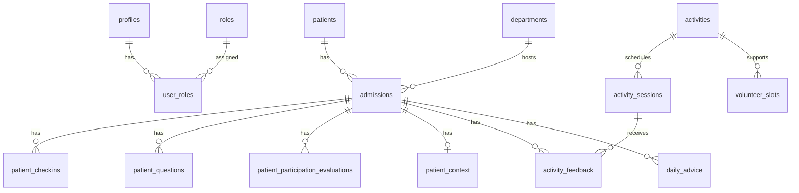

# OpnameBuddy — Domain Model

Living domain model and data blueprint. This document evolves with each feature branch.

> **Note:** Sections marked *Blueprint* describe intended tables and fields at planning level. They are not final SQL. Migrations in `supabase/migrations/` are the source of truth once applied.

---

## How to read this document

For each area:

1. **User / problem** — who needs this and why
2. **Entity** — the concept in the domain
3. **Ownership & relationships** — who owns data and how entities connect
4. **Business rules** — constraints the application must enforce
5. **Blueprint** — expected database shape (living, not final)

---

## Identity and access

> **Account/domain model — implemented (Phase 1 + Phase 2):**
> The account/domain model separates three concerns the original schema blurred. See [Domain and identity model](project-context.md#domain-and-identity-model) in `docs/project-context.md`.
>
> - **Login identity vs clinical patient identity are distinct.** `profiles` / `auth.users` model **login accounts**; **`patients`** models the **clinical patient**.
> - **`roles` / `user_roles` determine what an account may do** and stay separate from domain data.
> - **Patient-owned care data belongs to a patient/admission, not to a staff login.** Care context, check-ins, questions, and participation evaluations are owned by the clinical patient via `admission_id`. Staff appear only through audit fields (`created_by_staff_id`; `patient_context.updated_by_staff_id`).
> - **Staff/caregiver accounts are actors, not owners** of patient-owned data.
> - **Patient accounts are linked to patient records** via the secure `patient_link_codes` / `redeem_patient_link_code()` flow.
>
> **What shipped (Phase 1–3):** `patients`, `admissions`, `patient_account_links`, `patient_link_codes` (`00015`–`00018`); the four care tables are owned via a **`NOT NULL` `admission_id`** with admission-scoped RLS (`current_admission_ids()`) as the sole patient-side guard; the legacy `patient_id` columns and their `patient_id = auth.uid()` policies have been **dropped** (`00019`–`00026`); `patient_context` is now one row per admission (`UNIQUE(admission_id)`) and its staff audit field is **`updated_by_staff_id`** (`00027`). The caregiver read path (`list_care_patients()`, `/care/patients/[patientId]`) is keyed by `patients.id`.
>
> **Admin account management — implemented (branch 5):** Staff accounts are profiles with staff roles in user_roles (no staff_accounts table). Admins manage staff lifecycle and role assignment via server actions + service role (00028-00030). Self-registration assigns the patient role automatically. account_audit_events records admin actions (append-only). Patient-linked accounts are admin-readable only.
>
> **Patient admission management — implemented (branch 6):** Caregiver workflows for Patiënt opnemen, Nieuwe opname, Ontslag, demographics edit, expected discharge date, duplicate-prevention search, and patient link-code redemption. Plan: [`docs/branch-plans/branch-06-patient-admission-management.md`](branch-plans/branch-06-patient-admission-management.md).
>
> **Still deferred:** organizational (department/team/admission) caregiver access instead of the global `caregiver` role (and retiring `requireRole("patient")`-only reliance). Full history: [`docs/branch-plans/branch-04-account-domain-model.md`](branch-plans/branch-04-account-domain-model.md).

### User / problem

Everyone using OpnameBuddy authenticates via Supabase Auth. The app needs display names, language preference, and role-based module access without exposing the `auth` schema to client queries.

The refactor adds a further requirement: the system must also represent the **clinical patient** as its own entity, distinct from the login account that authenticates. A login identity is *who is acting*; a clinical patient is *who the care data is about*.

### Entity: Profile

App-specific user record, 1:1 with `auth.users`.

| Concern | Detail |
|---------|--------|
| Ownership | Each user owns their profile row |
| Relationships | Referenced by role/account links and staff audit fields (e.g. `updated_by_staff_id`) |

**Business rules**

- Created automatically on signup via `handle_new_user()` trigger
- Clients may read and update their own profile only (RLS)
- No client-side INSERT or DELETE on profiles

### Entity: Role and UserRole

Canonical role names and assignments.

| Concern | Detail |
|---------|--------|
| Ownership | Role catalog is system-managed; assignments are admin-managed |
| Relationships | `user_roles` links `profiles` ↔ `roles` |

**Business rules**

- Role names: `patient`, `caregiver`, `activity_coordinator`, `admin`
- Clients may read their own role assignments only
- Clients cannot assign or remove roles (prevents privilege escalation)
- Staff may have multiple roles; patients normally have only `patient`

### Blueprint: implemented tables

| Table | Key fields | Status |
|-------|------------|--------|
| `profiles` | `id`, `full_name`, `preferred_language`, timestamps | Implemented |
| `roles` | `id`, `name` | Implemented |
| `user_roles` | `user_id`, `role_id`, `created_at` | Implemented (admin-managed via server) |
| `account_audit_events` | `actor_user_id`, `target_user_id`, `action`, `metadata` | Implemented (append-only, service role) |

---

## Patient participation

### Daily check-in

#### User / problem

Patients need a simple daily moment to reflect on how they feel. Structured input supports caregiver review and later DailyBuddy advice without requiring medical self-diagnosis.

#### Entity: PatientCheckin

A patient-owned reflection about physical and emotional state on a given day.

| Concern | Detail |
|---------|--------|
| Ownership | `admission_id` → the clinical patient's admission |
| Relationships | Belongs to an `admissions` row (→ `patients`) |

**Business rules**

- Captures: pain, energy, mood, mobility, **motivation for activity participation**, symptoms, optional note
- UI encourages **one check-in per day**; database does **not** yet enforce uniqueness on `(admission_id, check_in_date)` — flexibility for MVP iteration
- Patients may **create** and **update** their own check-ins
- Patients may **not delete** check-ins (audit trail for caregivers and AI)
- Caregivers review check-ins in branch 3; patients only CRUD in branch 2

#### Blueprint: `patient_checkins` (branch 2 — **Implemented**)

| Field | Type (planned) | Notes |
|-------|----------------|-------|
| `id` | uuid PK | |
| `admission_id` | uuid FK → admissions | **NOT NULL** ownership key; patient's active admission on insert |
| `check_in_date` | date | App uses Europe/Amsterdam calendar day |
| `pain_score` | smallint | 0–10 |
| `energy_level` | smallint | 1–5 |
| `mood` | smallint | 1–5 |
| `mobility_level` | smallint | 1–5 |
| `motivation_score` | smallint | 1–5; how motivated to participate in an activity today |
| `symptoms` | text | Free-text; empty string if none |
| `note` | text | Optional reflection |
| `created_at`, `updated_at` | timestamptz | `set_updated_at` trigger |

Index on `(admission_id, check_in_date DESC)` for history lists. No UNIQUE on date pair yet.

---

### Patient question

#### User / problem

Patients forget important questions before rounds, visits or care moments. They need a simple **preparation editor**: write a question whenever it comes to mind, label it for the right **hospital specialism**, and keep it until they can discuss it with a caregiver.

**Branch 2:** editor + list only. Questions are **not** organized or summarized in the app yet.

**Branch 8 (QuestionBuddy):** open questions are organized into a **daily summary** (grouped by specialism, clearer wording) for use before rounds. The AI **never answers** medical questions — only organizes. See [`docs/future-questionbuddy-daily-summary.md`](../future-questionbuddy-daily-summary.md).

#### Entity: PatientQuestion

A question the patient wants to discuss with a specific caregiver specialism.

| Concern | Detail |
|---------|--------|
| Ownership | `admission_id` → the clinical patient's admission |
| Relationships | Belongs to an `admissions` row (→ `patients`) |

**Business rules**

- Target types (specialism): `doctor`, `nurse`, `physiotherapist`, `other`
- Status lifecycle: `open` → `discussed` → `answered`
- Patients may **create** questions (default status `open`)
- Patients may **edit** and **delete** only their own **open** questions
- `answer_notes` is reserved for **caregiver** use (branch 3); patients may read it when populated
- **No in-app daily summary in branch 2** — QuestionBuddy (branch 8) produces an organized daily list from open questions; it does not answer them

#### Blueprint: `patient_questions` (branch 2 — **Implemented**)

| Field | Type (planned) | Notes |
|-------|----------------|-------|
| `id` | uuid PK | |
| `admission_id` | uuid FK → admissions | **NOT NULL** ownership key |
| `question_text` | text | Required |
| `target_type` | text | CHECK: doctor, nurse, physiotherapist, other |
| `status` | text | CHECK: open, discussed, answered; default open |
| `answer_notes` | text | Nullable; caregiver writes in branch 3 |
| `created_at`, `updated_at` | timestamptz | |

---

### Participation evaluation (evening)

#### User / problem

After trying a suggested or planned activity, patients need a quick evening reflection on what they did and how it felt. This informs future DailyBuddy recommendations and complements morning motivation.

#### Entity: PatientParticipationEvaluation

A patient-owned reflection on participation in one activity on a given day.

| Concern | Detail |
|---------|--------|
| Ownership | `admission_id` → the clinical patient's admission |
| Relationships | Belongs to an `admissions` row (→ `patients`); optional `activity_session_id` when activities exist (branch 4) |

**Business rules**

- Status: `done`, `partly_done`, `not_done`
- `activity_title` holds a human-readable label until activity sessions exist
- Patients may **create** and **update** their own evaluations
- Patients may **not delete** evaluations
- UI polish deferred; data layer implemented first

#### Blueprint: `patient_participation_evaluations` (**Implemented**)

| Field | Type | Notes |
|-------|------|-------|
| `id` | uuid PK | |
| `admission_id` | uuid FK → admissions | **NOT NULL** ownership key |
| `evaluation_date` | date | Europe/Amsterdam calendar day |
| `activity_title` | text | Label from DagBuddy suggestion or patient input |
| `activity_session_id` | uuid | Nullable; FK in branch 4 |
| `status` | text | done, partly_done, not_done |
| `reason` | text | Optional; especially when partly_done or not_done |
| `effort_score` | smallint | 1–5 |
| `after_feeling_score` | smallint | 1–5; how patient feels after |
| `notes` | text | Optional |
| `created_at`, `updated_at` | timestamptz | |

**Scheduling (deferred):** The app does not yet distinguish morning vs evening by clock time — only by calendar date. See [`docs/future-participation-scheduling.md`](../future-participation-scheduling.md).

---

## Caregiver safety and context

### Patient context (Zorgcontext)

#### User / problem

Caregivers record **practical care facts** so DagBuddy and activity filtering can apply predefined safety rules. The form stores facts — not derived planning decisions such as volunteer eligibility or max activity intensity.

#### Entity: PatientContext

A caregiver-maintained snapshot of functional care context for one patient. One row per patient (upsert).

| Concern | Detail |
|---------|--------|
| Ownership | Belongs to the clinical patient's admission (`admission_id`, one row per admission). Written by caregivers; read by the linked patient (via admission), caregivers, activity coordinators, and later AI tools |
| Relationships | Belongs to an `admissions` row (→ `patients`); `updated_by_staff_id` tracks last caregiver (staff audit field) |

**Business rules**

- All enum fields include **`unknown`** as an intentional value — never interpreted as “no” or “safe”
- **Facts only** — volunteer suitability, intensity limits, and duration limits are derived later by DagBuddy from context + check-in + activity requirements
- Mobility aid fields are conditional on `mobility_status` (`walking_with_aid`, `wheelchair`)
- Additional attention points use `text[]` chips — non-critical, do not block completeness
- Living record: caregivers update in place as admission evolves (`updated_at`, `updated_by_staff_id`)
- Patients may **read** their own context; they cannot edit it

**Critical completeness fields:**

- `mobility_status`, `transfer_support`, `fall_risk`, `requires_supervision` (Begeleiding), `isolation_type`, `room_restriction` (Bewegingsvrijheid)
- `mobility_aid_available` when mobility status requires an aid
- Attention chips and notes do **not** block completeness

#### Blueprint: `patient_context` (branch 3 — **Implemented**)

| Field | Type | Notes |
|-------|------|-------|
| `id` | uuid PK | |
| `admission_id` | uuid FK → admissions | **NOT NULL**, **UNIQUE** ownership key; caregiver read/write is keyed on this |
| `mobility_status` | text | unknown, bed_bound, chair_only, wheelchair, walking_independent, walking_with_aid, walking_with_assistance |
| `transfer_support` | text | unknown, none, one_person, two_person, lift |
| `fall_risk` | text | unknown, low, medium, high |
| `requires_supervision` | text | unknown, not_required, required (UI: Begeleiding) |
| `mobility_aid_type` | text | Conditional; unknown, cane, walker, wheelchair, own_aid, other |
| `mobility_aid_available` | text | Conditional critical; unknown, yes, no |
| `isolation_type` | text | unknown, none, contact, droplet, airborne, strict, protective |
| `room_restriction` | text | unknown, room_only, ward_only, no_restriction (UI: Bewegingsvrijheid) |
| `additional_attention_points` | text[] | iv_pump, oxygen, catheter, wound_or_drain, post_surgery, fatigue, wandering_risk, language_barrier, cognitive_support, hearing_support, vision_support, communication_support, other |
| `additional_attention_notes` | text | Optional; UI when `other` chip selected |
| `notes` | text | Optional caregiver notes |
| `updated_by_staff_id` | uuid FK → profiles | Caregiver who last saved (staff audit field) |
| `created_at`, `updated_at` | timestamptz | `set_updated_at` trigger |

**Removed fields (migration `00012`):** `weight_bearing_status`, `has_iv_line`, `has_oxygen` — IV/oxygen captured via attention chips.

**Deprecated blueprints:** separate `patient_restrictions` (boolean flags) and `caregiver_contexts` (free text only) — superseded by unified `patient_context`.

---

## Activities and planning

> **Branch 7 (`feature/activity-planning-volunteers`) — in progress:** structured activity catalog, weekly recurring schedules, one-off sessions, volunteer availability, human approval workflow. Replaces the older `volunteer_slots` blueprint with `volunteer_recurring_availability` + `volunteer_availability_exceptions`. AI matching deferred to branch 8.

### Activity

#### User / problem

Activity coordinators need a reusable catalog of non-medical recovery participation options to schedule for patients.

#### Entity: Activity

Template for a participation activity (not a scheduled instance).

Examples: short walk, breathing exercise, chair exercise, social coffee moment, relaxation activity, creative activity.

| Concern | Detail |
|---------|--------|
| Ownership | Managed by activity coordinators |
| Relationships | Parent of activity sessions |

**Business rules**

- Non-medical participation only
- Properties may include type, intensity, location, supervision required, and where it can be done (bed, chair, room, ward, outside)

#### Blueprint: `activities` (branch 7 — **Planned**)

| Field | Type (planned) | Notes |
|-------|----------------|-------|
| `id` | uuid PK | |
| `title`, `description` | text | description **required** (AI context) |
| `category` | text | creative, movement, social, relaxation, other |
| `intensity` | text | low, medium, high |
| `location` | text | Default location |
| `allowed_settings` | text[] | bed, chair, room, ward, outside |
| `requires_supervision`, `requires_volunteer` | boolean | Structured requirement flags |
| `min_participants`, `max_participants` | int | Capacity on template |
| `mobility_notes` | text | Optional supplement |
| `is_active` | boolean | Soft deactivate |
| timestamps | timestamptz | |

---

### Activity session

#### User / problem

Patients and coordinators need scheduled instances of activities with time, place, and capacity.

#### Entity: ActivitySession

A scheduled occurrence of an activity.

#### Blueprint: `activity_sessions` (branch 7 — **Planned**)

| Field | Type (planned) | Notes |
|-------|----------------|-------|
| `id` | uuid PK | |
| `activity_id` | uuid FK | |
| `recurring_schedule_id` | uuid FK | Nullable; null = one-off |
| `session_kind` | text | recurring_instance, one_off |
| `starts_at`, `ends_at` | timestamptz | |
| `location` | text | Snapshot per session |
| `min_participants`, `max_participants` | int | Snapshot |
| `status` | text | draft, proposed, confirmed, completed, cancelled |
| `confirmed_at`, `confirmed_by_staff_id` | timestamptz / uuid | Human approval audit |
| timestamps | timestamptz | |

---

### Volunteer availability

#### User / problem

Volunteers manage when they can help. Coordinators read availability when manually assigning volunteers to sessions. Future DagBuddy uses this structured data for feasibility checks.

#### Entity: VolunteerRecurringAvailability / VolunteerAvailabilityException

Weekly windows owned by the volunteer, plus one-off extras or unavailability blocks.

#### Blueprint: `volunteer_recurring_availability` + `volunteer_availability_exceptions` (branch 7 — **Planned**)

| Table | Key fields |
|-------|------------|
| `volunteer_recurring_availability` | `user_id`, `day_of_week`, `start_time`, `end_time`, `is_active` |
| `volunteer_availability_exceptions` | `user_id`, `exception_date`, `start_time`, `end_time`, `kind` (extra \| unavailable) |

**Deprecated blueprint:** `volunteer_slots` — superseded by volunteer-owned availability (branch 7).

---

### Activity feedback

#### User / problem

After participating (or skipping) an activity, patients share how it went. Feedback personalizes future planning and informs DailyBuddy.

#### Entity: ActivityFeedback

Patient response to a completed or offered activity.

| Concern | Detail |
|---------|--------|
| Ownership | `admission_id` → the clinical patient's admission |
| Relationships | Belongs to an `admissions` row (→ `patients`); links to an `activity_session` when scheduled sessions exist |

**Business rules**

- Fields: completed/skipped, difficulty, enjoyment, optional note
- Branch 7 implementation

#### Blueprint: `activity_feedback` (branch 7)

| Field | Type (planned) | Notes |
|-------|----------------|-------|
| `id` | uuid PK | |
| `admission_id` | uuid FK → admissions | **NOT NULL** ownership key |
| `activity_session_id` | uuid FK | Optional; nullable until sessions exist |
| `outcome` | text | completed, skipped |
| `difficulty` | smallint | Scale TBD |
| `enjoyment` | smallint | Scale TBD |
| `note` | text | Optional |
| timestamps | timestamptz | |

---

## AI outputs

### Daily advice

#### User / problem

Patients benefit from a short, readable daily summary that combines their input with professional boundaries and feasible activities.

#### Entity: DailyAdvice

Stored output from DailyBuddy for a clinical patient's admission on a given day.

#### Blueprint: `daily_advice` (branch 6)

| Field | Type (planned) | Notes |
|-------|----------------|-------|
| `id` | uuid PK | |
| `admission_id` | uuid FK → admissions | **NOT NULL** ownership key |
| `advice_date` | date | |
| `context_summary` | text | Compact interpreted context |
| `motivation` | text | |
| `suggestions` | jsonb | 2–3 participation suggestions |
| `rest_suggestion` | text | |
| `open_questions_reminder` | text | Nullable |
| `created_at` | timestamptz | |

---

## Clinical patient (branch 6 — **Implemented**)

| Field | Type | Notes |
|-------|------|-------|
| `id` | uuid PK | |
| `first_name` | text NOT NULL | |
| `last_name` | text NOT NULL | |
| `birth_date` | date | nullable in DB; required on admit in app |
| `sex` | text | CHECK: M, F, X |
| `external_ref` | text | optional hospital ref |
| `created_by_staff_id` | uuid | audit |

### Admission extensions (branch 6)

| Field | Type | Notes |
|-------|------|-------|
| `expected_discharge_on` | date | nullable; indicative only (“Verwachte ontslagdatum”) |
| `department_id` | uuid FK → departments | nullable for legacy rows; required on new admits in app |
| `room_number` | text | nullable; e.g. `312A`, `IC-05` (replaces legacy `location`) |

### Departments (branch 6 refinement)

| Field | Type | Notes |
|-------|------|-------|
| `id` | uuid PK | |
| `name` | text NOT NULL | admin-managed |
| `code` | text | optional short code |
| `is_active` | boolean | deactivate merged departments instead of delete |
| `sort_order` | int | list ordering |

Department-scoped caregiver RLS and staff-to-department assignment remain **deferred**.

Duplicate prevention: workflow + name/DOB matching only — no BSN, no MPI, no unique constraint on demographics.

---

## Entity relationship overview

*Dashed conceptual entities (restrictions, activities, advice) are future branches.*

---

## RLS ownership patterns (cross-cutting)

| Pattern | Applies to |
|---------|------------|
| `admission_id in (select current_admission_ids())` for SELECT, INSERT, UPDATE | Patient-owned care tables — sole patient-side guard (admission ownership) |
| `patient_id = auth.uid()` | Retired for care tables (columns and policies dropped); still the pattern for `profiles`-owned data |
| No DELETE on check-ins | `patient_checkins` |
| DELETE only when `status = 'open'` | `patient_questions` (patient) |
| Caregiver read/write via `has_role()` policies | `patient_context`, check-ins, questions (branch 3) |
| Service role for admin and AI tools | Server-only, never client |

Always pair new tables with **explicit GRANT migrations** for `authenticated` and `service_role`.

### Caregiver patient list must be database-filtered

The caregiver patient list uses the `list_care_patients()` SECURITY DEFINER RPC, **not** a direct `profiles` select. Since migration `00033` it returns **clinical patients** with `first_name`, `last_name`, `birth_date`, `sex`, active `admission_id`, `expected_discharge_on`, and linked `user_id`. The caregiver UI keys routes by `patients.id` and reads/writes care data by admission.

---

## Document maintenance

| When | Action |
|------|--------|
| Start of a branch | Read relevant sections before implementing |
| End of a branch | Update blueprint status (Implemented / Planned), add fields discovered during implementation |
| Schema change | Update blueprint and regenerate `types/database.ts` |
