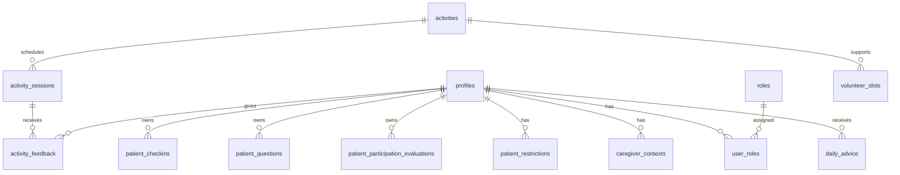

# OpnameBuddy — Domain Model

Living domain model and data blueprint. This document evolves with each feature branch.

> **Note:** Sections marked *Blueprint* describe intended tables and fields at planning level. They are not final SQL. Migrations in `supabase/migrations/` are the source of truth once applied.

---

## How to read this document

For each area:

1. **User / problem** — who needs this and why
2. **Entity** — the concept in the domain
3. **Ownership & relationships** — who owns data and how entities connect
4. **Business rules** — constraints the application must enforce
5. **Blueprint** — expected database shape (living, not final)

---

## Identity and access

### User / problem

Everyone using OpnameBuddy authenticates via Supabase Auth. The app needs display names, language preference, and role-based module access without exposing the `auth` schema to client queries.

### Entity: Profile

App-specific user record, 1:1 with `auth.users`.

| Concern | Detail |
|---------|--------|
| Ownership | Each user owns their profile row |
| Relationships | Referenced by all `patient_id` and staff attribution fields |

**Business rules**

- Created automatically on signup via `handle_new_user()` trigger
- Clients may read and update their own profile only (RLS)
- No client-side INSERT or DELETE on profiles

### Entity: Role and UserRole

Canonical role names and assignments.

| Concern | Detail |
|---------|--------|
| Ownership | Role catalog is system-managed; assignments are admin-managed |
| Relationships | `user_roles` links `profiles` ↔ `roles` |

**Business rules**

- Role names: `patient`, `caregiver`, `activity_coordinator`, `admin`
- Clients may read their own role assignments only
- Clients cannot assign or remove roles (prevents privilege escalation)
- Staff may have multiple roles; patients normally have only `patient`

### Blueprint: implemented tables

| Table | Key fields | Status |
|-------|------------|--------|
| `profiles` | `id`, `full_name`, `preferred_language`, timestamps | Implemented |
| `roles` | `id`, `name` | Implemented |
| `user_roles` | `user_id`, `role_id`, `created_at` | Implemented |

---

## Patient participation

### Daily check-in

#### User / problem

Patients need a simple daily moment to reflect on how they feel. Structured input supports caregiver review and later DailyBuddy advice without requiring medical self-diagnosis.

#### Entity: PatientCheckin

A patient-owned reflection about physical and emotional state on a given day.

| Concern | Detail |
|---------|--------|
| Ownership | `patient_id` = authenticated patient |
| Relationships | Belongs to `profiles` (patient) |

**Business rules**

- Captures: pain, energy, mood, mobility, **motivation for activity participation**, symptoms, optional note
- UI encourages **one check-in per day**; database does **not** yet enforce uniqueness on `(patient_id, check_in_date)` — flexibility for MVP iteration
- Patients may **create** and **update** their own check-ins
- Patients may **not delete** check-ins (audit trail for caregivers and AI)
- Caregivers review check-ins in branch 3; patients only CRUD in branch 2

#### Blueprint: `patient_checkins` (branch 2 — **Implemented**)

| Field | Type (planned) | Notes |
|-------|----------------|-------|
| `id` | uuid PK | |
| `patient_id` | uuid FK → profiles | `auth.uid()` on insert |
| `check_in_date` | date | App uses Europe/Amsterdam calendar day |
| `pain_score` | smallint | 0–10 |
| `energy_level` | smallint | 1–5 |
| `mood` | smallint | 1–5 |
| `mobility_level` | smallint | 1–5 |
| `motivation_score` | smallint | 1–5; how motivated to participate in an activity today |
| `symptoms` | text | Free-text; empty string if none |
| `note` | text | Optional reflection |
| `created_at`, `updated_at` | timestamptz | `set_updated_at` trigger |

Index planned on `(patient_id, check_in_date DESC)` for history lists. No UNIQUE on date pair yet.

---

### Patient question

#### User / problem

Patients forget important questions before rounds or care moments. Writing questions in advance helps them prepare and gives caregivers visibility into discussion topics.

#### Entity: PatientQuestion

A question the patient wants to discuss with a specific type of caregiver.

| Concern | Detail |
|---------|--------|
| Ownership | `patient_id` = authenticated patient |
| Relationships | Belongs to `profiles` (patient) |

**Business rules**

- Target types: `doctor`, `nurse`, `physiotherapist`, `other`
- Status lifecycle: `open` → `discussed` → `answered`
- Patients may **create** questions (default status `open`)
- Patients may **edit** and **delete** only their own **open** questions
- `answer_notes` is reserved for **caregiver** use (branch 3); patients may read it when populated
- QuestionBuddy (branch 8) may organize questions but never answers medical content

#### Blueprint: `patient_questions` (branch 2 — **Implemented**)

| Field | Type (planned) | Notes |
|-------|----------------|-------|
| `id` | uuid PK | |
| `patient_id` | uuid FK → profiles | |
| `question_text` | text | Required |
| `target_type` | text | CHECK: doctor, nurse, physiotherapist, other |
| `status` | text | CHECK: open, discussed, answered; default open |
| `answer_notes` | text | Nullable; caregiver writes in branch 3 |
| `created_at`, `updated_at` | timestamptz | |

---

### Participation evaluation (evening)

#### User / problem

After trying a suggested or planned activity, patients need a quick evening reflection on what they did and how it felt. This informs future DailyBuddy recommendations and complements morning motivation.

#### Entity: PatientParticipationEvaluation

A patient-owned reflection on participation in one activity on a given day.

| Concern | Detail |
|---------|--------|
| Ownership | `patient_id` = authenticated patient |
| Relationships | Belongs to `profiles`; optional `activity_session_id` when activities exist (branch 4) |

**Business rules**

- Status: `done`, `partly_done`, `not_done`
- `activity_title` holds a human-readable label until activity sessions exist
- Patients may **create** and **update** their own evaluations
- Patients may **not delete** evaluations
- UI polish deferred; data layer implemented first

#### Blueprint: `patient_participation_evaluations` (**Implemented**)

| Field | Type | Notes |
|-------|------|-------|
| `id` | uuid PK | |
| `patient_id` | uuid FK → profiles | |
| `evaluation_date` | date | Europe/Amsterdam calendar day |
| `activity_title` | text | Label from DagBuddy suggestion or patient input |
| `activity_session_id` | uuid | Nullable; FK in branch 4 |
| `status` | text | done, partly_done, not_done |
| `reason` | text | Optional; especially when partly_done or not_done |
| `effort_score` | smallint | 1–5 |
| `after_feeling_score` | smallint | 1–5; how patient feels after |
| `notes` | text | Optional |
| `created_at`, `updated_at` | timestamptz | |

**Scheduling (deferred):** The app does not yet distinguish morning vs evening by clock time — only by calendar date. See [`docs/future-participation-scheduling.md`](../future-participation-scheduling.md).

---

## Caregiver safety and context

### Patient restrictions

#### User / problem

Caregivers define hard safety boundaries so AI and planning never suggest activities outside professional limits.

#### Entity: PatientRestrictions

Structured, mostly boolean safety flags for one patient. Typically one active row per patient (upsert pattern in UI).

| Concern | Detail |
|---------|--------|
| Ownership | Written by caregivers; read by caregivers, AI tools, and planning logic |
| Relationships | Belongs to patient (`profiles`) |

**Business rules**

- Restrictions are **hard boundaries** — DailyBuddy and planning must never overrule them
- Hospital care appointments are **out of MVP scope** (would need EHR/calendar integration)

**Planned boolean fields (branch 3):**

- `may_get_out_of_bed`
- `may_leave_room`
- `may_leave_ward`
- `needs_supervision`
- `mobile_iv_or_pump`
- `isolation_precautions`
- `fall_risk`
- `wandering_risk`

#### Blueprint: `patient_restrictions` (branch 3)

| Field | Type (planned) | Notes |
|-------|----------------|-------|
| `id` | uuid PK | |
| `patient_id` | uuid FK → profiles | Unique per patient (planned) |
| boolean flags | boolean | See list above |
| `updated_by` | uuid FK → profiles | Caregiver who last changed |
| `created_at`, `updated_at` | timestamptz | |

---

### Caregiver context

#### User / problem

Structured checklists cannot capture every admission nuance. Caregivers need a place for open-ended context that helps DailyBuddy personalize suggestions without becoming a treatment plan.

#### Entity: CaregiverContext

Free-text context written by a caregiver about a patient's participation situation.

| Concern | Detail |
|---------|--------|
| Ownership | Written by caregivers for a patient |
| Relationships | Belongs to patient; tracks `updated_by` caregiver |

**Business rules**

- **Open-ended text only** — not a medical treatment plan
- Avoid fields like `recovery_goal` or `treatment_goal` (too close to medical advice)
- AI uses context for safe participation suggestions, not to set clinical goals

#### Blueprint: `caregiver_contexts` (branch 3)

| Field | Type (planned) | Notes |
|-------|----------------|-------|
| `id` | uuid PK | |
| `patient_id` | uuid FK → profiles | |
| `context_note` | text | Open-ended caregiver input |
| `updated_by` | uuid FK → profiles | Caregiver profile |
| `created_at`, `updated_at` | timestamptz | |

---

## Activities and planning

### Activity

#### User / problem

Activity coordinators need a reusable catalog of non-medical recovery participation options to schedule for patients.

#### Entity: Activity

Template for a participation activity (not a scheduled instance).

Examples: short walk, breathing exercise, chair exercise, social coffee moment, relaxation activity, creative activity.

| Concern | Detail |
|---------|--------|
| Ownership | Managed by activity coordinators |
| Relationships | Parent of activity sessions |

**Business rules**

- Non-medical participation only
- Properties may include type, intensity, location, supervision required, and where it can be done (bed, chair, room, ward, outside)

#### Blueprint: `activities` (branch 4)

| Field | Type (planned) | Notes |
|-------|----------------|-------|
| `id` | uuid PK | |
| `title`, `description` | text | |
| `activity_type` | text | |
| `intensity` | text | e.g. low, medium, high |
| `location` | text | Default location |
| `requires_supervision` | boolean | |
| `allowed_locations` | text[] or flags | bed, chair, room, ward, outside |
| timestamps | timestamptz | |

---

### Activity session

#### User / problem

Patients and coordinators need scheduled instances of activities with time, place, and capacity.

#### Entity: ActivitySession

A scheduled occurrence of an activity.

#### Blueprint: `activity_sessions` (branch 4)

| Field | Type (planned) | Notes |
|-------|----------------|-------|
| `id` | uuid PK | |
| `activity_id` | uuid FK | |
| `starts_at` | timestamptz | |
| `location` | text | Override per session |
| `capacity` | integer | |
| `requires_volunteer` | boolean | Optional |
| timestamps | timestamptz | |

---

### Volunteer slot

#### User / problem

Some activities need a volunteer. Coordinators register availability so DailyBuddy knows whether guided activities are feasible.

#### Entity: VolunteerSlot

Availability window linked to activities or sessions.

#### Blueprint: `volunteer_slots` (branch 4)

| Field | Type (planned) | Notes |
|-------|----------------|-------|
| `id` | uuid PK | |
| `activity_id` | uuid FK | |
| `starts_at`, `ends_at` | timestamptz | |
| `volunteer_name` or profile ref | text / uuid | TBD in branch 4 |
| timestamps | timestamptz | |

---

### Activity feedback

#### User / problem

After participating (or skipping) an activity, patients share how it went. Feedback personalizes future planning and informs DailyBuddy.

#### Entity: ActivityFeedback

Patient response to a completed or offered activity.

| Concern | Detail |
|---------|--------|
| Ownership | Patient-owned |
| Relationships | Links patient, activity or session |

**Business rules**

- Fields: completed/skipped, difficulty, enjoyment, optional note
- Branch 7 implementation

#### Blueprint: `activity_feedback` (branch 7)

| Field | Type (planned) | Notes |
|-------|----------------|-------|
| `id` | uuid PK | |
| `patient_id` | uuid FK | |
| `activity_session_id` | uuid FK | |
| `outcome` | text | completed, skipped |
| `difficulty` | smallint | Scale TBD |
| `enjoyment` | smallint | Scale TBD |
| `note` | text | Optional |
| timestamps | timestamptz | |

---

## AI outputs

### Daily advice

#### User / problem

Patients benefit from a short, readable daily summary that combines their input with professional boundaries and feasible activities.

#### Entity: DailyAdvice

Stored output from DailyBuddy for a patient on a given day.

#### Blueprint: `daily_advice` (branch 6)

| Field | Type (planned) | Notes |
|-------|----------------|-------|
| `id` | uuid PK | |
| `patient_id` | uuid FK | |
| `advice_date` | date | |
| `context_summary` | text | Compact interpreted context |
| `motivation` | text | |
| `suggestions` | jsonb | 2–3 participation suggestions |
| `rest_suggestion` | text | |
| `open_questions_reminder` | text | Nullable |
| `created_at` | timestamptz | |

---

## Entity relationship overview

*Dashed conceptual entities (restrictions, activities, advice) are future branches.*

---

## RLS ownership patterns (cross-cutting)

| Pattern | Applies to |
|---------|------------|
| `patient_id = auth.uid()` for SELECT, INSERT, UPDATE | Patient-owned tables |
| No DELETE on check-ins | `patient_checkins` |
| DELETE only when `status = 'open'` | `patient_questions` (patient) |
| Caregiver read/write via separate policies | Branch 3+ |
| Service role for admin and AI tools | Server-only, never client |

Always pair new tables with **explicit GRANT migrations** for `authenticated` and `service_role`.

---

## Document maintenance

| When | Action |
|------|--------|
| Start of a branch | Read relevant sections before implementing |
| End of a branch | Update blueprint status (Implemented / Planned), add fields discovered during implementation |
| Schema change | Update blueprint and regenerate `types/database.ts` |
